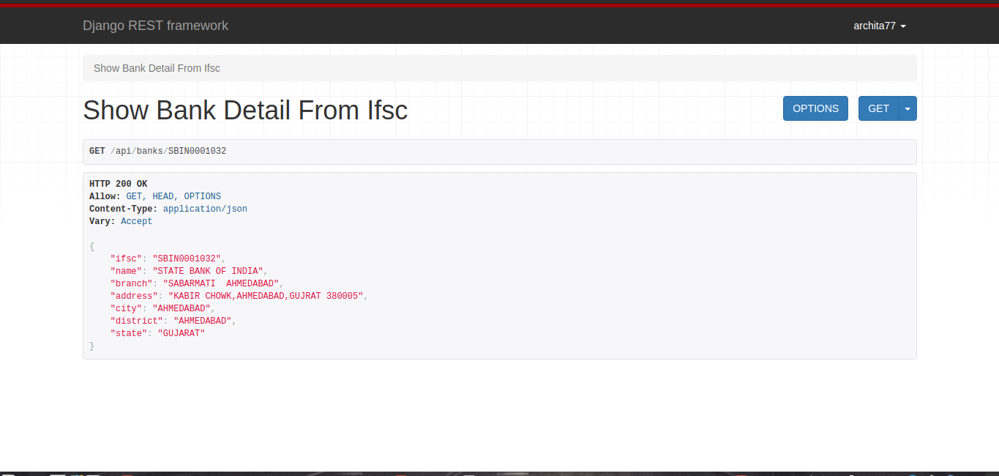
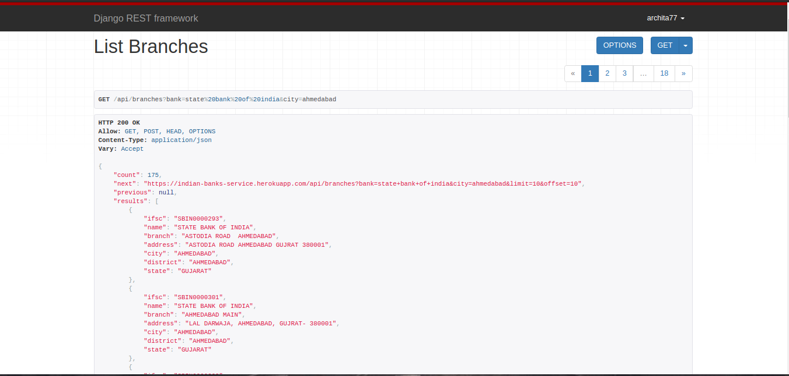

# Indian Banks' REST API

A REST API that provides bank details along with their branches across India, built using Django REST framework.

## CURL Script to Test Endpoints 
`curl_script_to_test_endpoints.sh` file contains a list of commands that make request for the access token, using which endpoints are accessed and the returned response is displayed in the terminal when script runs.

### To run the Script

Run following command to run this script which will show the details of bank & branches:
```
bash curl_script_to_test_endpoints.sh
```

## Screenshots 

#### Screenshots of DRF API results in the browser

###### Bank Details from IFSC


###### List of Branches - with Limit & Offset  



